# 移行方式 判断分析フロー（Mermaid）

`oracle_migration_assessment_report_final.md` 7章（移行方式の評価）における、
技術適合性・Downtime・Data Size・Application影響・移行複雑度・Data loss要件・Rollback／運用複雑度を
踏まえた比較検討の判断フローです。

現時点の結論は「Physical Online Migrationを有力候補として追加評価する」であり、
特定方式の推奨確定ではない点をフロー上でも明示しています。

```mermaid
flowchart TD
    Start([移行方式評価開始]) --> Criteria[評価観点を確認<br/>技術適合性 / Downtime / Data Size<br/>Application影響 / 移行複雑度<br/>Data loss要件 / Rollback・運用複雑度]

    Criteria --> Tech{技術適合性<br/>Source/Target共に19c EE<br/>ARCHIVELOG・FORCE LOGGING Enabled}
    Tech -->|Native Physical方式が<br/>技術的に成立し得る| Downtime
    Tech -->|Native方式の前提が<br/>崩れる場合| LogicalPath[Logical方式を検討]

    Downtime{Downtime要件<br/>上限2時間 / Data Size 1.2TB}
    Downtime -->|2時間以内に収まる<br/>見込みあり（未実測）| DataLoss
    Downtime -->|2時間超過の懸念| OfflineCheck[Offline方式は<br/>要件未達の可能性→High Risk]

    DataLoss{Data loss要件<br/>Data loss不可}
    DataLoss -->|Online同期方式で<br/>ゼロロス実現の可能性| AppImpact
    DataLoss -->|同期方式の実現性が<br/>未確認| Rehearsal1[Rehearsalで<br/>同期・整合性を検証]

    AppImpact{Application影響<br/>WebLogic / Batch35件 / DBLink4件<br/>外部IF6件 / SFTP / DNS切替}
    AppImpact -->|接続文字列変更のみ<br/>で影響を最小化できる可能性| Complexity
    AppImpact -->|切替影響が大きい<br/>可能性あり| AppMitigation[切替・停止再開手順の<br/>事前定義が必須]

    Complexity{移行複雑度<br/>Medium〜High・追加評価要}
    Complexity --> RollbackOps

    RollbackOps{Rollback／運用複雑度<br/>Target HA/DR未確定<br/>Cutover手順未確認}
    RollbackOps -->|Rehearsalで<br/>手順・時間を実証可能| Candidate

    AppMitigation --> Complexity
    Rehearsal1 --> AppImpact
    OfflineCheck --> AlternativeOffline

    Candidate[Physical Online Migration<br/>を現時点での有力候補とする]

    Candidate --> Validate{PoC / Migration Rehearsal<br/>でNetwork・HA・Rollback・<br/>Cutover時間を実測検証}

    Validate -->|全条件クリア<br/>2時間以内Cutover達成<br/>Rollback手順確立| Confirm[Physical Online Migration<br/>を正式採用として確定]
    Validate -->|一部条件未達<br/>（帯域不足 / HA未整備 等）| AlternativePhysicalOffline{Physical Offline<br/>実測停止時間が<br/>2時間以内か}

    AlternativePhysicalOffline -->|Yes| ConfirmOffline[Physical Offline Migration<br/>を代替方式として採用]
    AlternativePhysicalOffline -->|No| LogicalPath

    AlternativeOffline[Physical Offline<br/>Downtime要件適合を確認] --> AlternativePhysicalOffline

    LogicalPath --> LogicalEval{Logical Online Migration<br/>権限・Object・Timezone<br/>DB Link・整合性を比較検証}
    LogicalEval -->|Online要件を<br/>満たせる| ConfirmLogicalOnline[Logical Online Migration<br/>を代替方式として採用]
    LogicalEval -->|Online要件を<br/>満たせない| LogicalOffline[Logical Offline Migration<br/>を最終候補として要件確認]

    Confirm --> End([移行方式 確定])
    ConfirmOffline --> End
    ConfirmLogicalOnline --> End
    LogicalOffline --> End

    style Candidate fill:#fff3cd,stroke:#b8860b,stroke-width:2px
    style Confirm fill:#d4edda,stroke:#28a745,stroke-width:2px
    style ConfirmOffline fill:#d4edda,stroke:#28a745,stroke-width:1px
    style ConfirmLogicalOnline fill:#d4edda,stroke:#28a745,stroke-width:1px
    style LogicalOffline fill:#f8d7da,stroke:#dc3545,stroke-width:1px
```

## フローの読み方

1. **評価観点の確認**：レポート7.1の7つの観点（技術適合性 / Downtime / Data Size / Application影響 / 移行複雑度 / Data loss要件 / Rollback・運用複雑度）を起点に評価します。
2. **技術適合性 → Downtime → Data loss → Application影響 → 移行複雑度 → Rollback／運用複雑度** の順に条件を確認し、いずれかで懸念が生じた場合は代替検討または追加検証（Rehearsal等）に分岐します。
3. 全観点を通過した結果、**Physical Online Migrationを現時点での有力候補**とします（7.3の結論）。ただしこの時点では推奨確定ではありません。
4. **PoC / Migration Rehearsal** で Network帯域・HA構成・Rollback手順・Cutover時間を実測検証し、その結果に応じて次のいずれかに分岐します。
   - 全条件クリア → **Physical Online Migrationを正式採用**
   - 一部条件未達 → **Physical Offline Migration**（Downtime実測が2時間以内なら採用）
   - Physical方式が不成立 → **Logical Online Migration**（権限・Object・Timezone・DB Link・整合性を比較）、それも不成立なら **Logical Offline Migration** を要件確認の上で最終候補とします。

この判断フローは、レポート 7.2「移行方式比較表」および 7.3「現時点での有力な移行方式候補／代替方式」の内容を可視化したものであり、Assessment時点の暫定結論（追加評価前提）を示しています。
