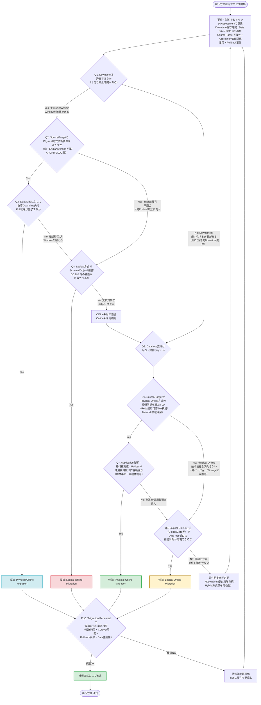

# Oracle Database移行方式 選定 汎用判断フロー（Mermaid）

特定案件のAssessment結果（実測値）を前提とせず、**要件Input収集前でも使える汎用の意思決定フレームワーク**です。
Physical Online / Physical Offline / Logical Online / Logical Offlineの4方式のうち、
どれを推奨方式とするかを、技術適合性・Downtime・Data Size・Application影響・移行複雑度・
Data loss要件・Rollback／運用複雑度の7観点で段階的に絞り込みます。

各Decisionノードの分岐条件は、実際の案件でヒアリング・Assessmentにより確定させることを前提とした
「確認すべき問い」として設計しています。

## 各Decisionノードの意図

| ノード | 確認する内容 | 主に効く評価観点 |
| --- | --- | --- |
| Q1 | Downtime Windowの有無（業務停止を許容できるか） | Downtime |
| Q2 (Offline) | Physical方式の技術前提（Platform/Endian/Version/ARCHIVELOG等）を満たすか | 技術適合性 |
| Q3 (Offline) | Data SizeとDowntime Windowから見た転送実現性 | Data Size, Downtime |
| Q4 | Logical方式でのSchema/Object/権限変換が許容範囲か | 移行複雑度, Application影響 |
| Q5 | Data loss要件（ゼロロス必須か） | Data loss要件 |
| Q6 | Physical Online方式の技術前提（Redo適用、HA、Network帯域） | 技術適合性 |
| Q7 | Application影響・移行複雑度・Rollback／運用複雑度が許容範囲か | Application影響, 移行複雑度, Rollback/運用複雑度 |
| Q8 | Logical Online（GoldenGate等）でゼロロス継続同期が実現できるか | Data loss要件, 技術適合性 |
| Validate | PoC/Rehearsalによる実測検証（最終ゲート） | 全観点の実証 |

## 使い方

1. **Q0で要件・制約をInputとして収集**します（本フローはInput収集前の思考の出発点として使用し、実際の判断にはヒアリング・Assessment結果が必要です）。
2. Downtime許容度（Q1）を起点に、Offline系／Online系へ大きく分岐します。
3. 各系統の中で、技術適合性→Data Size／Data loss→複雑度・運用性の順に絞り込みます。
4. 最終的に1つ以上の候補方式が残った場合、**PoC / Migration Rehearsalでの実測検証**を経てから初めて「推奨方式」として確定します（実測前の段階では有力候補に留めます）。
5. 検証で要件を満たせない場合は、他候補の再評価または要件自体の見直し（Downtime緩和、段階移行、Hybrid方式等）にフィードバックします。

この汎用フローは、今回のPRODDB案件のような具体的な数値（1.2TB、2時間等）を含まない形にしており、他のOracle Database移行案件でも共通の判断ロジックとして再利用できます。
