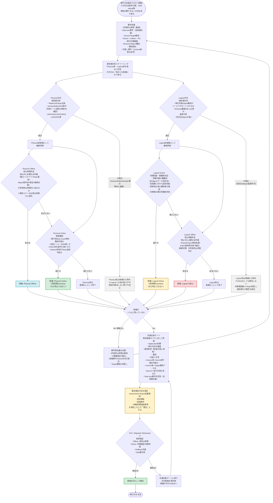

# Oracle Database移行方式 選定 汎用判断フロー v2（Mermaid）

v1へのレビュー指摘を反映した改訂版です。主な変更点は次のとおりです。

- 4方式（Physical Online / Physical Offline / Logical Online / Logical Offline）は
  **「基本分類」**であり、ZDMのRMAN+Data Pump Hybrid方式等、単純に分類できない方式もある旨を明記。
- 判断順序を **要件収集 → 技術適合性で候補抽出 → 停止時間・同期性能で絞り込み → 共通比較 →
  暫定推奨 → PoC／Rehearsal → 実施方式確定** に変更。
- 「Physical不可→Logical」「Logical不可→Online」のような**誤った救済分岐を廃止**し、
  Physical系・Logical系は独立に適合性を判定する。
- Offline系は「Full転送時間」ではなく**「停止中に必要な全作業（復元・リカバリ・オブジェクト作成・
  検証・接続切替を含む）が許容停止時間内に収まるか」**で判定。
- Online＝業務停止ゼロではなく**「短時間Downtime」**である旨を明記。
- Data loss要件は**全候補共通の検証条件**としてQ0で収集し、個別分岐から外す。
- Physical Onlineの前提は「HA構成が必須」ではなく**「移行用Data Guard／ツールの対応条件を満たすか」**に変更。
- 複雑度・運用負荷・費用・切戻しは**4方式共通の比較ゲート**として一箇所に集約。
- 切戻しは **Cutover（Target更新開始）前 / 後** を明確に分けて評価する項目とする。
- ツール固有条件（Edition制約、Version/RU条件等）と汎用的な方式条件を区別する注記を追加。

## v1からの主な修正点と理由

| # | v1の問題 | v2での修正 |
| --- | --- | --- |
| 1 | Q1「十分な停止時間」が定性的判断 | Q0で許容停止時間を数値化し、各候補の想定停止時間との比較で判定する構成に変更 |
| 2 | Physical Offlineが時間超過でもLogical Offlineの時間判定がなかった | Physical/Logicalの両Offline経路に、それぞれ独立した停止時間判定ノードを設置 |
| 3 | Offline判定が「Full転送時間」のみ | 「停止中に必要な全作業（復元・リカバリ・オブジェクト再作成・検証・接続切替）が許容時間内か」に変更し、事前コピー可能な分は停止時間から除外する旨を明記 |
| 4 | Logical変換不可→Physical Onlineへの読み替え | 誤った救済分岐を廃止。Physical系・Logical系はそれぞれ独立に適合性を判定し、不適合の場合はその系統を候補から除外（対象範囲見直し等へ） |
| 5 | Data lossのYes/No分岐が機能していなかった | Q0で全候補共通の検証条件として収集し、個別のDecisionノードから除外。最終的な共通比較ゲートで充足性を確認 |
| 6 | Physical Onlineの前提が「HA構成必須」と読める、Storage非互換の基準が曖昧 | 「移行用Data Guardを構成可能か／利用ツールのOnline対応条件を満たすか」に変更 |
| 7 | 複雑度NGでLogical Onlineへ逃げる分岐（運用が簡単とは限らない） | Application影響・運用負荷・費用・切戻しを4方式共通の比較ゲートに集約し、個別分岐からは排除 |
| 8 | 「継続同期できる」と「切替時Data lossゼロを確認できる」を同一視 | 「同期対象の網羅性、更新停止後の最終差分適用、切替後の整合性確認手段」に分けて判定 |
| 9 | Online＝ゼロDowntimeという表現 | 「短時間Downtime」に統一し、完全無停止はApplication側を含む別途検討事項と明記 |
| 10 | 汎用条件とツール固有条件（Edition制約、Version/RU等）が混在 | 技術適合性ノードに「利用ツール固有の制約を確認」と明記し、汎用要件とツール要件を区別 |
| 11 | 4方式で網羅できる前提だった | 冒頭に「基本分類」であり、Hybrid方式（RMAN+Data Pump等）が存在し得る旨を明記 |
| 12 | 切戻しの評価が単一項目だった | 共通比較ゲートで「Cutover前」「Cutover後（Target更新データのSourceへの反映手段）」を分けて評価 |

## 推奨する判断順序（本フローの骨格）

1. **要件収集**：許容停止時間、Data loss要件、Source/Target構成、移行対象範囲、費用、切戻し要件（Cutover前後）
2. **技術適合性で候補抽出**：Physical／Logicalそれぞれの可否と、利用ツール（ZDM等）固有の対応条件を確認
3. **停止時間・同期性能で絞り込み**：Offlineは停止中作業の総所要時間、Onlineは変更量・同期追従性能・切替時間で判定
4. **共通比較**：Application影響、対応作業量、運用負荷、費用、切戻し（Cutover前後）を残存候補すべてで比較
5. **暫定推奨 → PoC／Rehearsal → 実施方式確定**：暫定推奨の段階では、根拠・前提・未確認事項を明記した上でAssessment Reportに記載し、実測検証を経て確定する

## Assessment Report活用時の注意

- 実測前の「暫定推奨方式」を提示する場合は、**選定根拠・前提条件・未確認/要検証事項**を必ず併記し、
  確定推奨と区別できる表現（例：「有力候補」「追加評価が必要」）を用いる。
- Online方式は「ゼロDowntime」ではなく「短時間Downtime」であることを明記し、
  完全無停止（真のゼロDowntime）を求める場合はApplication側のアーキテクチャ（Blue/Green等）を
  含めた別途検討が必要である旨を注記する。
- 4方式の基本分類に加え、ZDMのHybrid方式（RMAN + Data Pump）など、
  単純に分類できない方式が存在し得ることを明記する。

## 参考（Oracle公式ドキュメント）

- 移行・切替手順（Downtimeの実態）: https://docs.oracle.com/en/database/oracle/zero-downtime-migration/21.4/zdmug/migrating-with-zero-downtime-migration.html
- Physical移行の前提条件（Edition/Version/RU等のツール固有制約）: https://docs.oracle.com/en/database/oracle/zero-downtime-migration/26.1/zdmug/preparing-for-database-migration.html
- 移行方式一覧（Hybrid方式を含む）: https://docs.oracle.com/en/database/oracle/zero-downtime-migration/26.1/zdmug/introduction-to-zero-downtime-migration.html
