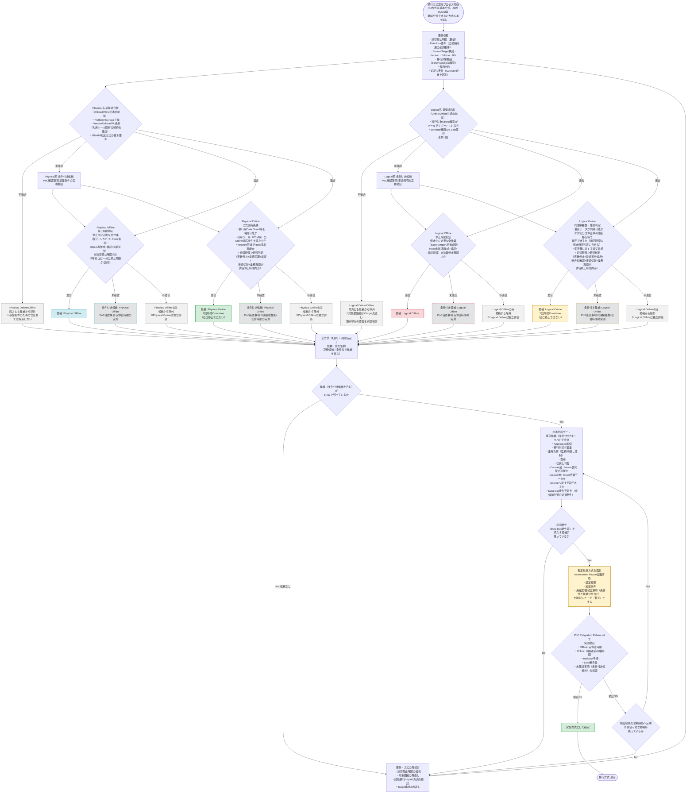

# Oracle Database移行方式 選定 汎用判断フロー v3（Mermaid）

v2へのレビュー指摘（①〜⑤および技術条件の書き方2点）を反映した改訂版です。

## v2からの主な変更点

| # | v2の問題 | v3での修正 |
| --- | --- | --- |
| ① | Physical Online不成立で系統全体（Offlineも含む）を除外していた | 「系統共通の基盤適合性（Platform/Endian/Version等）」と「方式固有条件（Online用のData Guard対応等）」を分離。方式固有条件の不成立は**その方式のみ**を除外し、他方式は独立評価を継続 |
| ② | 不適合経路から直接候補集約に進み、他方式の評価完了前に「候補なし」と判断され得た | 全4方式（Physical Online/Offline, Logical Online/Offline）の評価完了を待つ「**評価結果の集約**」ノードを追加。Online/Offline間の横断矢印を廃止し、完全に独立評価に統一 |
| ③ | Onlineは同期性能のみ判定し、切替時停止時間の判定が図になかった | Physical Online・Logical Onlineの両方に「**更新停止・最終同期・検証・接続切替・業務再開が許容停止時間内か**」の判定を追加 |
| ④ | 共通ゲート通過後、必ず暫定推奨に進み、全候補が必須要件未達の場合の出口がなかった | 共通比較ゲートの後に「**必須要件（Data loss等）を満たす候補が残るか**」の判定を追加し、Noなら要件／方式の再検討へ |
| ⑤ | PoC失敗後、「候補が尽きればQ0へ」と本文にあるが図はCommonGateにしか戻っていなかった | 「**検証結果を反映し、再評価可能な候補があるか**」を追加し、Yesは共通比較ゲートへ、Noは要件再定義へ接続 |
| 技術条件-1 | ARCHIVELOG等を一括必須としてOnline/Offline区別なく判定していた | 系統共通の基盤条件（Platform/Endian/Version/Edition/RU等）と、Online固有条件（Data Guard対応等）を明確に分離 |
| 技術条件-2 | Logical Onlineで「全Object/データ型対応」を要求し厳しすぎた | 「同期対象の更新データが同期可能か、非対応分は停止中の個別移行等で補完できるか（補完時間も停止時間判定に含める）」に変更 |
| 状態管理 | 適合/不適合の2値判定のみだった | 全ての技術・時間判定ノードを**適合／不適合／未確認**の3状態に変更。未確認は除外せず「条件付き候補・PoC確認事項」として保持 |

## 3状態管理（適合／不適合／未確認）の運用ルール

| 状態 | 意味 | 図上の扱い |
| --- | --- | --- |
| 適合 | Input（ヒアリング・Assessment結果）で条件充足が確認できた | 正規候補として共通比較ゲートへ進む |
| 不適合 | Inputで条件不充足が明確に確認できた | 原則としてその方式（基盤条件の場合は系統全体）を候補から除外する |
| 未確認 | Inputだけでは判定できない（実測・詳細調査が必要） | **除外せず「条件付き候補」として残す**。PoC/Rehearsalでの確認事項として明記し、共通比較ゲート・暫定推奨に含める |

未確認判定が多い場合、暫定推奨は「条件付き候補を含む」ことを明記し、Assessment Reportでは
「本方式は◯◯の実測結果次第で適合性が変わる」といった留保付きの表現を用いる。

## 推奨する判断順序（骨格は v2 から変更なし）

1. **要件収集**：許容停止時間、Data loss要件、Source/Target構成、移行対象範囲、費用、切戻し要件（Cutover前後）
2. **技術適合性で候補抽出**：Physical／Logicalそれぞれの**基盤条件**と、Online/Offline個別の**方式固有条件**を分けて確認（適合／不適合／未確認の3状態）
3. **停止時間・同期性能で絞り込み**：Offlineは停止中作業の総所要時間、Onlineは同期網羅性・追従性能に加え切替時停止時間で判定
4. **全方式の評価完了を待って候補を集約**：一部方式の不適合だけで打ち切らない
5. **共通比較**：Application影響、対応作業量、運用負荷、費用、切戻し（Cutover前後）を残存候補（条件付き含む）すべてで比較し、Data loss等の必須要件充足性を確認
6. **暫定推奨 → PoC／Rehearsal → 実施方式確定**：検証NGの場合は再評価可能な候補があれば共通比較ゲートへ戻り、候補が尽きれば要件・方式の再検討（Q0）へ

## Assessment Report活用時の注意（v2から継続）

- 実測前の「暫定推奨方式」を提示する場合は、**選定根拠・前提条件・未確認/要検証事項**（条件付き候補を含む）を必ず併記し、
  確定推奨と区別できる表現（例：「有力候補」「条件付き候補」「追加評価が必要」）を用いる。
- Online方式は「ゼロDowntime」ではなく「短時間Downtime」であることを明記し、
  完全無停止（真のゼロDowntime）を求める場合はApplication側のアーキテクチャ（Blue/Green等）を
  含めた別途検討が必要である旨を注記する。
- 4方式の基本分類に加え、ZDMのHybrid方式（RMAN + Data Pump）など、
  単純に分類できない方式が存在し得ることを明記する。
- 系統共通の基盤条件（Platform/Endian/Version/Edition/RU等）と、
  Online固有の方式条件（Data Guard対応、同期性能等）は明確に区別して記載する。

## 参考（Oracle公式ドキュメント）

- 移行・切替手順（Downtimeの実態）: https://docs.oracle.com/en/database/oracle/zero-downtime-migration/21.4/zdmug/migrating-with-zero-downtime-migration.html
- Physical移行の前提条件（Edition/Version/RU等のツール固有制約）: https://docs.oracle.com/en/database/oracle/zero-downtime-migration/26.1/zdmug/preparing-for-database-migration.html
- 移行方式一覧（Hybrid方式を含む）: https://docs.oracle.com/en/database/oracle/zero-downtime-migration/26.1/zdmug/introduction-to-zero-downtime-migration.html
