# Oracle Database移行方式 選定 汎用判断フロー v4（Mermaid）

v3へのレビュー指摘を反映した改訂版です。今回の主眼は
**「未確認」の状態をAssessmentからPoCまで一貫して引き継ぐこと**です。

## v3からの主な変更点

| # | v3の問題 | v4での修正 |
| --- | --- | --- |
| 1 | 基盤条件が「未確認」でも、後続の停止時間判定が「適合」なら通常の「候補」に格上げされていた | **上流（基盤条件）が未確認の場合、後続がすべて適合でも「条件付き候補」を維持**する規則を明記。後続で不適合が判明した時点でのみ除外する |
| 2 | `RequireCheck`がYes/Noの2分岐で、必須要件が「未確認」の候補しかない場合の扱いが不明だった | **3分岐**に変更：①充足確認済み候補あり→暫定推奨、②未確認の条件付き候補のみ→条件付き暫定推奨、③全候補が必須要件に不適合→要件・方式再検討 |
| 3 | `Validate`の検証OKだけで確定していたため、未確認事項が残ったまま確定する余地があった | 「**選定方式の必須条件がすべて確認済みで、かつ実測結果が合格基準を満たす場合のみ確定**」に条件を厳格化。未確認が残る場合は確定不可とし、確認作業を継続 |
| 4 | Offlineノードが停止時間判定のみで、本文の「方式固有条件も確認する」という記述と不一致だった | 両Offlineノードを「**方式固有の技術条件＋停止時間判定**」の複合判定に変更し、図と本文を一致させた |
| 技術条件 | 基盤条件と方式固有条件の切り分け基準が曖昧だった | 基盤適合性は「**Online/Offline両方に適用されることが確認できた共通条件のみ**」と定義。方式・ツール固有条件は各方式ノードで個別評価。非対応項目は個別移行等による補完可否を含めて判断する旨を明記 |

```mermaid
flowchart TD
    Start([移行方式選定プロセス開始<br/>※4方式は基本分類。ZDM Hybrid等<br/>単純分類できない方式もあり得る]) --> Q0

    Q0[要件収集<br/>・許容停止時間（数値）<br/>・Data loss要件（全候補共通の必須要件）<br/>・Source/Target構成・Version・Edition・RU<br/>・移行対象範囲（Schema/Object種別）<br/>・費用制約<br/>・切戻し要件（Cutover前/後を区別）]

    Q0 --> TechPhysicalBase
    Q0 --> TechLogicalBase

    %% ===== Physical系：基盤適合性 =====
    TechPhysicalBase{Physical系 基盤適合性<br/>※Online/Offline両方に適用される<br/>ことが確認できた共通条件のみ判定<br/>・Platform/Storage互換<br/>・Version/Edition/RU条件<br/>（利用ツール固有の制約を確認）<br/>・RMAN/転送方式の基本要件}

    TechPhysicalBase -->|不適合| PhysicalAllExcluded[Physical Online/Offline<br/>両方とも候補から除外<br/>※基盤条件のため方式変更では解消しない]
    TechPhysicalBase -->|未確認 →<br/>フラグ:BaseUnconfirmed=Physical| PhysicalOfflineCheck
    TechPhysicalBase -->|適合| PhysicalOfflineCheck
    TechPhysicalBase -->|未確認 →<br/>フラグ:BaseUnconfirmed=Physical| PhysicalOnlineCheck
    TechPhysicalBase -->|適合| PhysicalOnlineCheck

    PhysicalOfflineCheck{Physical Offline<br/>方式固有の技術条件＋停止時間判定<br/>・方式固有条件:媒体/転送経路の対応可否<br/>・停止時間:停止中に必要な全作業<br/>（復元+リカバリ+Redo適用+<br/>Object再作成+検証+接続切替）<br/>が許容停止時間内か<br/>※事前コピー分は停止時間から除外<br/>※基盤条件が未確認の場合は<br/>本判定が適合でも条件付き候補を維持}
    PhysicalOfflineCheck -->|適合<br/>かつ基盤条件も適合確定| CandPhysicalOffline[候補: Physical Offline]
    PhysicalOfflineCheck -->|適合だが基盤条件未確認、<br/>または本判定自体が未確認| CandPhysicalOfflineCond[条件付き候補: Physical Offline<br/>PoC確認事項: 未確認の基盤条件/実停止時間の実測<br/>（未解消の未確認項目をすべて引き継ぐ）]
    PhysicalOfflineCheck -->|不適合| PhysicalOfflineExcluded[Physical Offlineのみ<br/>候補から除外<br/>※Physical Onlineは独立評価]

    PhysicalOnlineCheck{Physical Online<br/>方式固有条件＋切替時停止時間判定<br/>・方式固有条件:移行用Data Guard等を<br/>構成可能か/利用ツール（ZDM等）の<br/>Online対応条件/Network帯域で<br/>Redo追従可能か<br/>・切替時停止時間:更新停止+最終同期+<br/>検証+接続切替+業務再開が<br/>許容停止時間内か<br/>※基盤条件が未確認の場合は<br/>本判定が適合でも条件付き候補を維持}
    PhysicalOnlineCheck -->|適合<br/>かつ基盤条件も適合確定| CandPhysicalOnline[候補: Physical Online<br/>※短時間Downtime<br/>（ゼロ停止ではない）]
    PhysicalOnlineCheck -->|適合だが基盤条件未確認、<br/>または本判定自体が未確認| CandPhysicalOnlineCond[条件付き候補: Physical Online<br/>PoC確認事項: 未確認の基盤条件/<br/>同期追従性能/切替時間の実測<br/>（未解消の未確認項目をすべて引き継ぐ）]
    PhysicalOnlineCheck -->|不適合| PhysicalOnlineExcluded[Physical Onlineのみ<br/>候補から除外<br/>※Physical Offlineは独立評価]

    %% ===== Logical系：基盤適合性 =====
    TechLogicalBase{Logical系 基盤適合性<br/>※Online/Offline両方に適用される<br/>ことが確認できた共通条件のみ判定<br/>・移行対象Object種別が<br/>ツールでサポートされるか<br/>・Schema/権限/DB Link等の<br/>変換可否<br/>（非対応は個別移行等での<br/>補完可否を含めて判断）}

    TechLogicalBase -->|不適合| LogicalAllExcluded[Logical Online/Offline<br/>両方とも候補から除外<br/>※対象範囲縮小/Target見直し/<br/>個別移行の要否を別途検討]
    TechLogicalBase -->|未確認 →<br/>フラグ:BaseUnconfirmed=Logical| LogicalOfflineCheck
    TechLogicalBase -->|適合| LogicalOfflineCheck
    TechLogicalBase -->|未確認 →<br/>フラグ:BaseUnconfirmed=Logical| LogicalOnlineCheck
    TechLogicalBase -->|適合| LogicalOnlineCheck

    LogicalOfflineCheck{Logical Offline<br/>方式固有の技術条件＋停止時間判定<br/>・方式固有条件:Export/Import<br/>対応可否、非対応Objectの<br/>個別移行補完可否<br/>・停止時間:停止中に必要な全作業<br/>（Export/Import相当処理+<br/>Index/制約再作成+検証+<br/>接続切替、補完作業含む）が<br/>許容停止時間内か<br/>※基盤条件が未確認の場合は<br/>本判定が適合でも条件付き候補を維持}
    LogicalOfflineCheck -->|適合<br/>かつ基盤条件も適合確定| CandLogicalOffline[候補: Logical Offline]
    LogicalOfflineCheck -->|適合だが基盤条件未確認、<br/>または本判定自体が未確認| CandLogicalOfflineCond[条件付き候補: Logical Offline<br/>PoC確認事項: 未確認の基盤条件/実停止時間の実測<br/>（未解消の未確認項目をすべて引き継ぐ）]
    LogicalOfflineCheck -->|不適合| LogicalOfflineExcluded[Logical Offlineのみ<br/>候補から除外<br/>※Logical Onlineは独立評価]

    LogicalOnlineCheck{Logical Online<br/>方式固有条件＋切替時停止時間判定<br/>・方式固有条件:更新データが<br/>同期可能か/非対応分は停止中の<br/>個別移行等で補完できるか<br/>（補完時間も停止時間判定に含める）/<br/>変更量に対する追従性能<br/>・切替時停止時間:更新停止+<br/>最終差分適用+整合性確認+<br/>接続切替+業務再開が<br/>許容停止時間内か<br/>※基盤条件が未確認の場合は<br/>本判定が適合でも条件付き候補を維持}
    LogicalOnlineCheck -->|適合<br/>かつ基盤条件も適合確定| CandLogicalOnline[候補: Logical Online<br/>※短時間Downtime<br/>（ゼロ停止ではない）]
    LogicalOnlineCheck -->|適合だが基盤条件未確認、<br/>または本判定自体が未確認| CandLogicalOnlineCond[条件付き候補: Logical Online<br/>PoC確認事項: 未確認の基盤条件/<br/>同期網羅性/切替時間の実測<br/>（未解消の未確認項目をすべて引き継ぐ）]
    LogicalOnlineCheck -->|不適合| LogicalOnlineExcluded[Logical Onlineのみ<br/>候補から除外<br/>※Logical Offlineは独立評価]

    %% ===== 全方式の評価完了を待って集約 =====
    PhysicalAllExcluded --> Aggregate
    CandPhysicalOffline --> Aggregate
    CandPhysicalOfflineCond --> Aggregate
    PhysicalOfflineExcluded --> Aggregate
    CandPhysicalOnline --> Aggregate
    CandPhysicalOnlineCond --> Aggregate
    PhysicalOnlineExcluded --> Aggregate
    LogicalAllExcluded --> Aggregate
    CandLogicalOffline --> Aggregate
    CandLogicalOfflineCond --> Aggregate
    LogicalOfflineExcluded --> Aggregate
    CandLogicalOnline --> Aggregate
    CandLogicalOnlineCond --> Aggregate
    LogicalOnlineExcluded --> Aggregate

    Aggregate[全方式（4通り）の評価完了<br/>候補一覧を集約<br/>（適合候補／条件付き候補／除外候補を<br/>区別したまま保持）]

    Aggregate --> CheckAnyCandidate{候補（条件付き候補を含む）が<br/>1つ以上残っているか}

    CheckAnyCandidate -->|No: 候補なし| Reassess[要件・方式の再検討<br/>・許容停止時間の緩和<br/>・対象範囲の見直し<br/>・段階移行/Hybrid方式の検討<br/>・Target構成の見直し]
    Reassess --> Q0

    CheckAnyCandidate -->|Yes| CommonGate[共通比較ゲート<br/>残存候補（適合／条件付きを区別して）すべてで評価<br/>・Application影響<br/>・移行対応作業量<br/>・運用負荷（監視/切戻し体制）<br/>・費用<br/>・切戻し可否<br/>　- Cutover前: Source側で復旧可能か<br/>　- Cutover後: Target更新データを<br/>　  Sourceへ戻す手段があるか<br/>・Data loss要件充足性<br/>（適合／不適合／未確認で判定）]

    CommonGate --> RequireCheck{必須要件<br/>（Data loss要件等）の充足状況で分岐}

    RequireCheck -->|①充足確認済みの<br/>候補がある| Provisional[暫定推奨方式を選定<br/>Assessment Report記載事項:<br/>・選定根拠<br/>・前提条件<br/>・未確認/要検証事項（あれば明記）<br/>を明記した上で「暫定」とする]

    RequireCheck -->|②未確認の条件付き<br/>候補のみが残っている| ProvisionalConditional[条件付き暫定推奨を選定<br/>Assessment Report記載事項:<br/>・「必須要件を含め未確認事項が<br/>残っている」ことを明記<br/>・PoCで必須要件の充足確認を<br/>最優先事項として設定]

    RequireCheck -->|③全候補が必須要件に<br/>不適合| Reassess

    Provisional --> Validate
    ProvisionalConditional --> Validate

    Validate{PoC / Migration Rehearsalで<br/>実測検証<br/>・Offline: 実停止時間<br/>・Online: 同期遅延/切替時間<br/>・Rollback手順<br/>・Data整合性<br/>・未確認事項（基盤条件/方式固有条件/<br/>必須要件を含む）の検証}

    Validate --> ConfirmCheck{選定方式の必須条件が<br/>すべて確認済みになり、<br/>かつ実測結果が<br/>合格基準を満たすか}

    ConfirmCheck -->|Yes:<br/>全条件確認済み+合格| Confirm[実施方式として確定]

    ConfirmCheck -->|No:<br/>未確認が残る、または<br/>不合格項目がある| ReflectResult{検証結果を候補評価へ反映<br/>（未確認→適合/不適合が<br/>確定した項目を更新）<br/>再評価可能な候補が<br/>残っているか}

    ReflectResult -->|Yes| CommonGate
    ReflectResult -->|No| Reassess

    Confirm --> End([移行方式 決定])

    style CandPhysicalOnline fill:#d4edda,stroke:#28a745,stroke-width:2px
    style CandPhysicalOffline fill:#d1ecf1,stroke:#17a2b8,stroke-width:2px
    style CandLogicalOnline fill:#fff3cd,stroke:#b8860b,stroke-width:2px
    style CandLogicalOffline fill:#f8d7da,stroke:#dc3545,stroke-width:2px
    style CandPhysicalOnlineCond fill:#e2e3e5,stroke:#28a745,stroke-width:1px,stroke-dasharray: 4 2
    style CandPhysicalOfflineCond fill:#e2e3e5,stroke:#17a2b8,stroke-width:1px,stroke-dasharray: 4 2
    style CandLogicalOnlineCond fill:#e2e3e5,stroke:#b8860b,stroke-width:1px,stroke-dasharray: 4 2
    style CandLogicalOfflineCond fill:#e2e3e5,stroke:#dc3545,stroke-width:1px,stroke-dasharray: 4 2
    style Provisional fill:#fff3cd,stroke:#b8860b,stroke-width:2px
    style ProvisionalConditional fill:#e2e3e5,stroke:#b8860b,stroke-width:1px,stroke-dasharray: 4 2
    style Confirm fill:#d4edda,stroke:#28a745,stroke-width:2px
    style PhysicalAllExcluded fill:#f1f1f1,stroke:#888,stroke-width:1px
    style LogicalAllExcluded fill:#f1f1f1,stroke:#888,stroke-width:1px
    style PhysicalOfflineExcluded fill:#f1f1f1,stroke:#888,stroke-width:1px
    style PhysicalOnlineExcluded fill:#f1f1f1,stroke:#888,stroke-width:1px
    style LogicalOfflineExcluded fill:#f1f1f1,stroke:#888,stroke-width:1px
    style LogicalOnlineExcluded fill:#f1f1f1,stroke:#888,stroke-width:1px
```

## 「未確認」の一貫した引継ぎルール（本改訂の核心）

1. **上流（基盤条件）が未確認の場合、下流判定がすべて適合でも「候補」には格上げしない。**
   条件付き候補のまま維持し、未解消の未確認項目（基盤条件分＋下流判定分）をすべてPoC確認事項として引き継ぐ。
2. **下流判定（方式固有条件＋停止時間/切替時間判定）で不適合が判明した時点で、その方式は除外する。**
   基盤条件が未確認のままであっても、下流で不適合が確定すれば除外して問題ない（不適合は上書きされない）。
3. **「適合」への昇格は、基盤条件と方式固有条件・時間判定の両方が確認済み（適合）になった場合のみ**行う。
4. **共通比較ゲート通過後の`RequireCheck`は3分岐**とする。
   - 必須要件（Data loss等）が確認済みで充足している候補がある → 通常の暫定推奨
   - 必須要件が未確認の条件付き候補のみが残る → 条件付き暫定推奨（PoCで必須要件確認を最優先とする旨を明記）
   - 必須要件に明確に不適合の候補しか残らない → 要件・方式の再検討
5. **PoC/Rehearsal後の確定判定（`ConfirmCheck`）は、「選定方式の必須条件がすべて確認済みとなり、
   かつ実測結果が合格基準を満たす場合」のみ**とする。未確認が1つでも残る場合は確定せず、
   検証結果を候補評価に反映した上で再評価を継続する。

## 基盤条件と方式固有条件の切り分け（本改訂で明確化）

- **基盤適合性（Physical系／Logical系それぞれ）**：Online/Offlineの**両方に共通して適用されることが確認できた条件のみ**を判定する。
  例：Physical系ならPlatform/Storage互換、Version/Edition/RU条件。Logical系なら移行対象Objectの種別対応、Schema/権限変換可否。
- **方式固有条件（Online/Offline個別）**：上記以外の、特定方式・特定ツールにのみ適用される条件を各方式のノードで個別に評価する。
  例：Physical Onlineの移行用Data Guard構成可否、Logical Onlineの同期性能・非対応Objectの補完可否。
- 非対応項目（Logical系の非対応Object等）は、**個別移行等による補完が可能か**を含めて判断し、
  補完が必要な場合はその作業時間も停止時間判定に含める。
- これにより、Online固有の条件不足でOfflineまで一律除外される、あるいはその逆が起きないようにする。

## 3状態管理（適合／不適合／未確認）の運用ルール（v3から継続、明確化）

| 状態 | 意味 | 図上の扱い |
| --- | --- | --- |
| 適合 | Input（ヒアリング・Assessment結果）で条件充足が確認できた | 他の判定もすべて適合確定の場合のみ正規候補として共通比較ゲートへ進む |
| 不適合 | Inputで条件不充足が明確に確認できた | 原則としてその方式（基盤条件の場合は系統全体）を候補から除外する。上流が未確認でも下流の不適合確定で除外される |
| 未確認 | Inputだけでは判定できない（実測・詳細調査が必要） | **除外せず「条件付き候補」として残す**。上流・下流のいずれかに未確認が残る限り、候補は「条件付き」のまま維持し、正規候補には昇格しない |

## 推奨する判断順序（骨格は v2/v3 から変更なし）

1. **要件収集**：許容停止時間、Data loss要件、Source/Target構成、移行対象範囲、費用、切戻し要件（Cutover前後）
2. **技術適合性で候補抽出**：Physical／Logicalそれぞれの**基盤条件（Online/Offline共通）**と、**方式固有条件（Online/Offline個別）**を分けて確認（適合／不適合／未確認の3状態、未確認は下流へ引き継ぐ）
3. **停止時間・同期性能で絞り込み**：Offlineは方式固有条件＋停止中作業の総所要時間、Onlineは方式固有条件＋同期網羅性・追従性能・切替時停止時間で判定
4. **全方式の評価完了を待って候補を集約**：適合候補／条件付き候補／除外候補を区別したまま保持する
5. **共通比較**：Application影響、対応作業量、運用負荷、費用、切戻し（Cutover前後）を残存候補すべてで比較し、必須要件（Data loss等）の充足状況を3分岐で判定
6. **暫定推奨（または条件付き暫定推奨） → PoC／Rehearsal → 実施方式確定**：確定は全必須条件が確認済みかつ実測合格の場合のみ。未確認が残れば候補評価へ差し戻し、候補が尽きれば要件・方式の再検討（Q0）へ

## Assessment Report活用時の注意（v2/v3から継続）

- 実測前の「暫定推奨方式」を提示する場合は、**選定根拠・前提条件・未確認/要検証事項**（条件付き候補を含む）を必ず併記し、
  確定推奨と区別できる表現（例：「有力候補」「条件付き候補」「追加評価が必要」）を用いる。
- 「条件付き暫定推奨」の場合は、必須要件（Data loss等）が未確認であることを明示し、
  PoCで最優先に確認すべき事項として位置づける。
- Online方式は「ゼロDowntime」ではなく「短時間Downtime」であることを明記し、
  完全無停止（真のゼロDowntime）を求める場合はApplication側のアーキテクチャ（Blue/Green等）を
  含めた別途検討が必要である旨を注記する。
- 4方式の基本分類に加え、ZDMのHybrid方式（RMAN + Data Pump）など、
  単純に分類できない方式が存在し得ることを明記する。
- 基盤条件（Online/Offline共通）と方式固有条件は明確に区別して記載する。

## 参考（Oracle公式ドキュメント）

- 移行・切替手順（Downtimeの実態）: https://docs.oracle.com/en/database/oracle/zero-downtime-migration/21.4/zdmug/migrating-with-zero-downtime-migration.html
- Physical移行の前提条件（Edition/Version/RU等のツール固有制約）: https://docs.oracle.com/en/database/oracle/zero-downtime-migration/26.1/zdmug/preparing-for-database-migration.html
- 移行方式一覧（Hybrid方式を含む）: https://docs.oracle.com/en/database/oracle/zero-downtime-migration/26.1/zdmug/introduction-to-zero-downtime-migration.html
